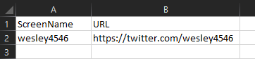
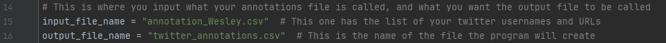

# Twitter Annotations

## Introduction 

The purpose of this program is so that anyone can rapidly go through a list of twitter user URLs and answer questions about them; in other words a very simple data-entry program. Equipped with a saving mechanism to save your progress after finishing an account.

## Tutorial

It's relatively simple to setup but important to do these steps:

### Step 1

  * Your `input.csv` must contain the following 2 columns:
    * `ScreenName` which is the twitter username (The @ one)
    * `URL` the URL to the user
    

For Example:

### Step 2

Make sure that in you `main.py` that you have the correct file names for both:
 * `input_file_name`
 
 * `output_file_name`
 
For Example:

## Adding a question*

If you would like to add a question or change the questionnaire do make sure you do this:

 1. In `questionnaire.py` make sure to add a new `qX` variable to the `Responses` class
 1. Add the desired question in the `question` dictionary
 1. Add where in the `questionnaire()` function you would like to place the question (the `## INPUT ##` Section)
 1. Add the question to the `out` variable (the `## OUTPUT##` Section)
 1. Add the column name to the `create_output_csv` function in `create_output_csv.py`
 1. Add the variable to `csv_file_rows` in `annotator_progam.py`

*Make sure to have all the questions you want before you start your annotation process. Once you start you annotating process there is no way to add a question and have the program re-iterate through your URLs. In that case you would have to start over. 

